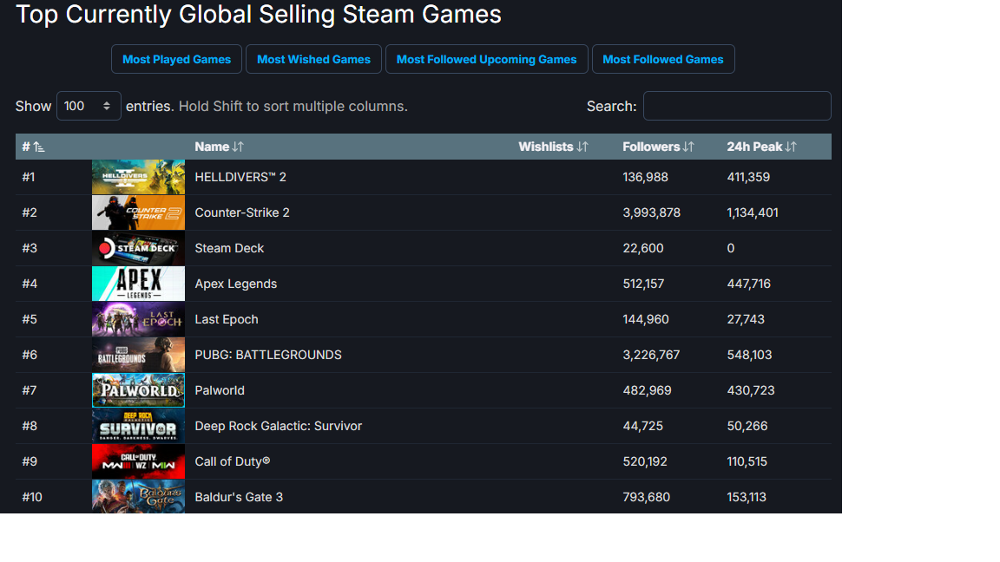

# ai-case-study
ai case study for Pocketpair Inc
# Pocketpair's Break into the Gaming world

## Pocketpair has only been around since 2015 but its already broke Steam's Top 10

Pocketpair Inc.

[Pocketpair](https://www.pocketpair.jp/aboutus) was founded in April of 2015 by [Takuro Mizobe](https://www.gematsu.com/companies/pocket-pair#:~:text=Pocket%20Pair%20is%20a%20video%20game%20developer%20headquartered,known%20for%20Craftopia%20and%20Palworld.%20Founded%3A%20April%202015) who is not only the founder, but the current president and CEO. Pocketpair was founded on the earnings that Takuro  Mizobe had made with his Coincheck virtual currency exchange compainy, he had this to [say](https://automaton-media.com/en/interviews/20240123-25950/): 
> " I was originally an engineer in the web industry and did all kinds of work, including starting up businesses. But eventually, my love for video games brought me back to the game industry. After working on various titles, I've finally come to the point where I can work on a relatively large-scale game such as Palworld."
He has also developed video games such as Overdungeon, Craftopia, but now PalWorld is Mizobe's biggest success. Even though the company was originally funded by Takuro Mizobe and his earnings from Coincheck, the recently released Palworld generated **171.3 million** in [sales](https://dotesports.com/palworld/news/how-much-money-has-palworld-made-steam-and-total-earnings) during the first *week* of release with a budget of 6.7 million bringing the company from red to green. 

## Business Activities

Size seems to be this company's main problem from a blog on [PC Gamer](https://www.pcgamer.com/its-a-miracle-that-palworld-exists-according-to-the-studio-founder-it-was-the-antithesis-of-proper-game-development/) The Pocketpair team that developed palworld started only 3 people and a lot of the people that were influencial to the companies success were hired only after the game development was underway with no one originally on the team that had an animation background. Since releasing Palwrold the company has been aggresively seeking new team members to help the company expand. Pocketpair is currently marketing its games to users of [Steam](https://backlinko.com/steam-users) with over 120 million active users, and [Xbox](https://techreport.com/statistics/xbox-user-statistics/) with an active user count of 100-120 million users. Their latest inovation of Palworld sold a record 7million by January 24th according to [PCGamer](https://www.pcgamer.com/palworld-is-2024s-first-breakout-hit-why-is-it-so-popular/#:~:text=Palworld%20has%20broken%20records%20for%20downloads%2C%20streams%2C%20popularity,seven%20million%20and%20counting%20in%20the%20first%20week)'s Rich Stanton since its release on January 19th only 5 days earlier. This placed it in the top 10 of steam sales. It was hailed as the first big hit of 2024. [Palworld](https://en.wikipedia.org/wiki/Palworld) uses Unreal Engine 4 for its world development as unreal engine has a long standing history of success in first person shooters and AI for non-player characters. 

## Landscape

Pocketpair targets the PC and Xbox gaming audience, targeting older gamers with a cute but edgy experience. Technology advancedments have made worlds of difference in the gaming industry as technical advancements seem to double every 10 years. Gaming over the [past decade](https://www.polygon.com/features/2019/12/19/20997738/gaming-trends-2019-2010-decade) has seen a significant shift from publisher owned games to smaller indie companies that can now market dirrectly to the consumer. Pocketpair, being one of these companies that owns its own games has reaped the benefits of this. Another trend in the gaming industry has been micro transactions that has risen in poplularity from a financial stand point but not from a player standpaoint. Pocketpair has been avoiding these microtransactions to side with the players. As with all leasure activities, games and the gaming industry compete for your time. With pocket pair breaking into the [top 10 of Steam](https://steamdb.info/stats/globaltopsellers/) its now competing with giants like Sledgehammer Games with Call of Duty, Larian Studios with Balder's Gate 3, Arrowhead Game Studios with Helldivers, and Valve with Counter-Strike 2. 

## Results

Pocketpair has made it's mark landing in the top 10 of currently selling Steam games. The sales and player count say it all when it comes to games of leisure. 171.3 million in sales during the first week of release with a budget of 6.7 million for making the game. Over 8 million copies of the prereleased game have sold so far. The company is struggling to keep up with the success of palworld from and interview with the companies CEO. From a company that was started in 2015, to be swinging with the giants of steams top ten is a mark of major success. With budgets that are fractions of the best sellers this is a real David vs. Goliath story. 

## Recommendations

The game company has already seen massive success with its early release of Palworld but the game needs more content and better AI for its characters. More content is solve by time and money to put into it, but the AI could benefit from the [Havok](https://www.havok.com/about-havok/) engine. The Havok engine is designed to respond to player inputs in a realistic manor that the games of Pocketpair could benefit from. Providing these updates and then expanding on an already successful game will provide more of the same lovable, edgy content the consumers have already loved. This technology has already worked for successful games like [Left 4 dead 2](https://en.wikipedia.org/wiki/Left_4_Dead_2) when the need is for the environment to react to the players actions. Adding this could only add to the success of and already successful company. 
